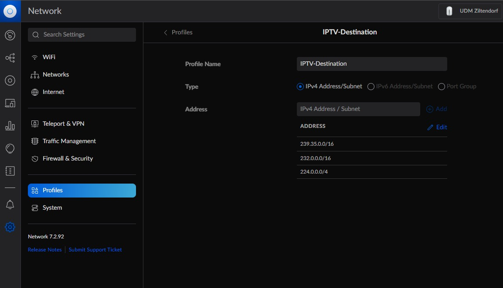
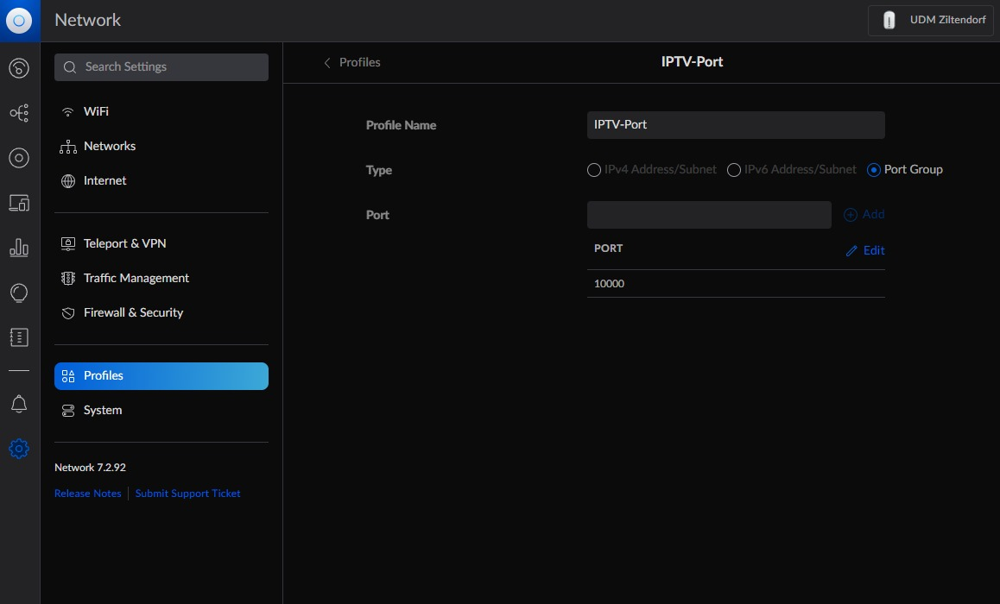
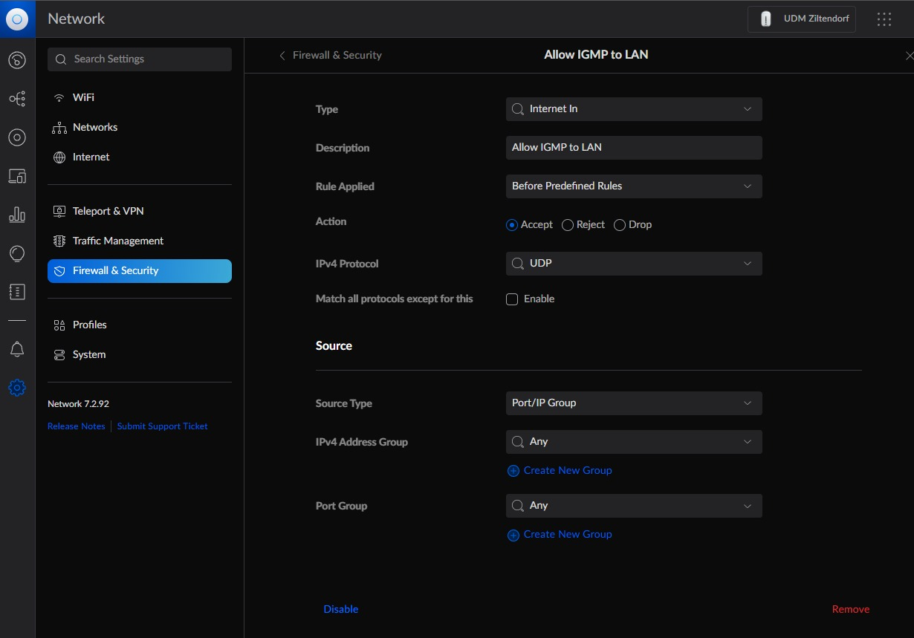
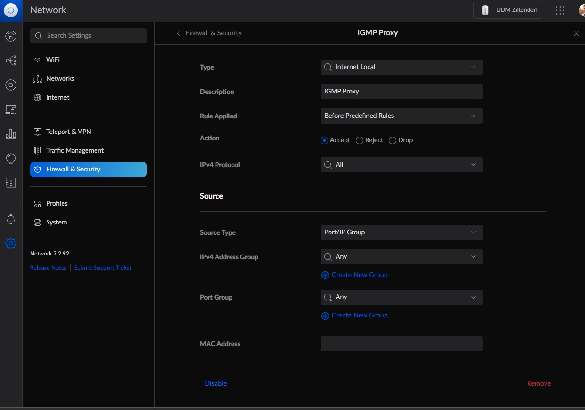
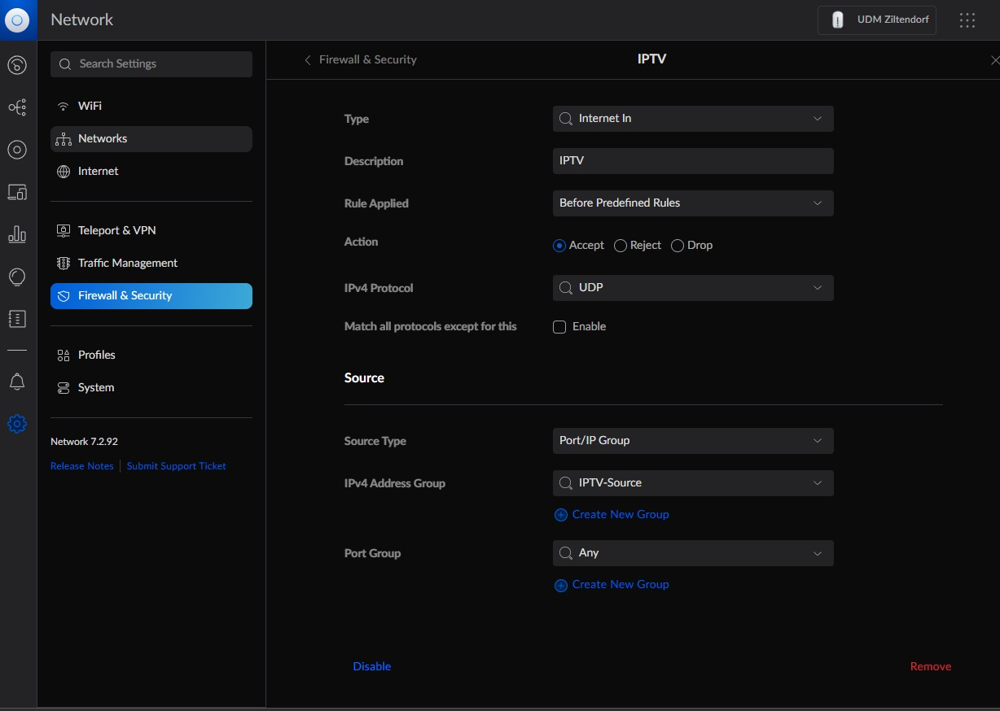

# Magenta TV on UniFi Dream Machine (Pro)

This Guide is based on: [UDM-IPTV by @fabianishere](https://github.com/fabianishere/udm-iptv) ([License applies](https://github.com/fabianishere/udm-iptv/blob/master/COPYING.txt))

This document describes how to set up Maagenta TV on UniFi routing devices based on UniFi OS, such as the UniFi Dream Machine (UDM). These instructions have been tested with Magenta TV from Telekom. However, the general approach should be applicable for other ISPs as well.

For getting IPTV to work on the legacy UniFi Security Gateway, please refer to the [following guide](https://github.com/basmeerman/unifi-usg-kpn).

## Contents

1. [Global Design](#global-design)
1. [Prerequisites](#prerequisites)
1. [Setting up Internet Connection](#setting-up-internet-connection)
1. [Configuring Internal LAN](#configuring-internal-lan)
1. [Configuring Helper Tools](#configuring-helper-tools)
1. [Troubleshooting and Known Issues](#troubleshooting-and-known-issues)

## Global Design

```
         DSL
          |
    +----------+
    |  DrayTek |
    +----------+
          |
      VLAN7 - Set on UDM not DrayTek
          |
      +--------+
      |  UDM   | 
      +--------+
          |
         LAN
          |
    +--------------+ 
    | IPTV Decoder |
    +--------------+ 
  - Magenta TV Box
```

# Prerequisites

Make sure you check the following prerequisites before trying the other steps:

1. The kernel on your UniFi device must support multicast routing
   in order to support IPTV:
    - **UniFi Dream Machine (Pro)**: Multicast routing is supported natively in the stock kernel since
   [firmware version 1.11](https://community.ui.com/releases/UniFi-OS-Dream-Machines-1-11-0/eef95803-6976-499b-9169-bf6dfbbcc209). 
   If you for some reason cannot use firmware v1.11+, see [udm-kernel](https://github.com/fabianishere/udm-kernel)
   for a kernel that supports multicast routing for older firmware versions of the UDM/P.
    - **UniFi Dream Machine Pro SE**: You need
      [Early Access firmware 2.3.7+](https://community.ui.com/releases/UniFi-OS-Dream-Machine-SE-2-3-7/2cf1632b-bcf6-4b13-a61d-f74f1e51242c)
      for multicast routing support.
    - **UniFi Dream Router**: Multicast routing is supported by the default 
      firmware.
2. The switches in-between the IPTV decoder and the UniFi device should have IGMP
   snooping enabled. They do not need to be from Ubiquiti necessarily.
3. The Modem of your ISP must be connected to
   one of the WAN ports of your UniFi device and must not handle VLANs. VLAN should be configured on UDM side.
   

## Setting up Internet Connection

The first step is to set up your internet connection to your ISP with the UniFi
device acting as modem, instead of some intermediate device. These steps might
differ per ISP, so please check the requirements for your ISP.

Below, we describe the steps for Telekom.

### Telekom
If you are a customer of Telekom, you can set up the WAN connection as follows:

1. In your UniFi Dashboard, go to **Settings > Internet**.
2. Select the WAN port that is connected to the Modem.
3. Enable **VLAN ID** and set it to 7 for Telekom.
4. Set **IPv4 Connection** to _PPPoE_.
5. For Telekom, **Username** should be set to your "Zugangsnummer".
6. For Telekom, **Password** should be set to your "persönliches Kennwort".

## Configuring Internal LAN

To operate correctly, the IPTV decoders on the internal LAN possibly require
additional DHCP options. You can add these DHCP options as follows:

1. In your UniFi Dashboard, go to **Settings > Networks**.
2. Select the LAN network on which IPTV will be used.
   We recommend creating a separate LAN network for IPTV traffic if possible in
   order to reduce interference of other devices on the network.
3. Enable **Advanced Configuration > IGMP Snooping**, so IPTV traffic is only
   sent to devices that should receive it.
4. Go to **DHCP > Custom DHCP Option** and add the following options:

   | Name       | Code | Type       | Value               |
   |------------|:----:|------------|---------------------|
   | IPTV-Class |  60  | Text       | IPTV_RG             |
   
## Create Profiles






## Create Firewall Rules
It is important to exactly match the rule category (e.g. Internet In, ...):








## Configuring Helper Tools

### udm-utilities

#### Upgrade from earlier way

* As long as you didn't change the filenames, installing the deb package is all you need to do.  If you want to clean up beforehand anyways....

    ```bash
    rm /etc/init.d/udm.sh
    systemctl disable udmboot
    rm /etc/systemd/system/udmboot.service
    ```

* [build_deb.sh](build_deb.sh) can be used to build the package by yourself.
    * [dpkg-build-files](dpkg-build-files) contains the sources that debuild uses to build the package if you want to build it yourself / change it
    * by default it uses docker or podman to build the debian package
    * use ```./build_deb.sh build``` to not use a container
    * the resulting package will be in [packages/](packages/)

* Built on Ubuntu-20.04 on Windows 10/WSL2

#### Install

You can execute in UDM/Pro/SE and UDR with (do not use unifi-os shell for this - use UbiOS!):

```bash
curl -fsL "https://raw.githubusercontent.com/unifi-utilities/unifios-utilities/HEAD/on-boot-script/remote_install.sh" | /bin/sh
```

This is a force to install script so will uninstall any previous version and install on_boot keeping your on boot files.

This will also install CNI Plugins & CNI Bridge scripts. If you are using UDMSE/UDR remember that you must install podman manually because there is no podman.

#### Create Helper scripts
Based on: [Issue](https://github.com/fabianishere/udm-iptv/issues/2#issuecomment-1030589790)
These scripts cover issues with losing connection on IP change. I have two small scripts to restart the proxy when an IP change is detected:
You can register all kinds of event triggers through on_boot.d and manipulate containers through podman - even the OS.

```bash
vim /mnt/data/ipchange
```
with following content...
```
#!/bin/sh

LASTIP=$(cat /tmp/lastip)

while sleep 3
do
  IP=$(ip addr show ppp0  | grep "inet " | awk ' { print $2 } ')
  echo $IP > /tmp/lastip

  if [ "$LASTIP" != "$IP" ]
  then
    logger -t ipchange -p INFO "IP of ppp0 changed from $LASTIP to $IP"
    LASTIP="$IP"
    echo $IP > /tmp/lastip
    CONTAINER=$(podman restart iptv)
    logger -t ipchange -p INFO "iptv container restarted as # $CONTAINER"
  fi

done
```

... and ...

```bash
vim /mnt/data/on_boot.d/94-ipchange.sh
```
with following content...
```
#!/bin/sh

cd /tmp
nohup /mnt/data/ipchange &

```

... and finally make it executable with ...

```bash
chmod +x /mnt/data/on_boot.d/94-ipchange.sh
```


### udm-iptv

Next, we will use the udm-iptv package to get IPTV working on your LAN.
This package uses [igmpproxy](https://github.com/pali/igmpproxy) to route 
multicast IPTV traffic between WAN and LAN.

#### Installation
SSH into your machine and execute the commands below in UniFi OS (not in UbiOS).
On the UniFi Dream Machine (Pro), use `unifi-os shell` to enter UniFi OS from
within UbiOS.
```bash
# Download udm-iptv package
curl -O -L https://github.com/fabianishere/udm-iptv/releases/download/v2.1.4/udm-iptv_2.1.4_all.deb
# Download a recent igmpproxy version
curl -O -L http://ftp.debian.org/debian/pool/main/i/igmpproxy/igmpproxy_0.3-1_arm64.deb
# Update APT sources and install dialog package for interactive install
apt update && apt install dialog
# Install udm-iptv and igmpproxy
apt install ./igmpproxy_0.3-1_arm64.deb ./udm-iptv_2.1.4_all.deb
```

It may be possible that `apt` reports a warning after installation (like shown below),
but this has no effect on the installation process, so you can simply ignore it.
> N: Download is performed unsandboxed as root as file '/root/igmpproxy_0.3-1_arm64.deb' couldn't be accessed by user '_apt'. - pkgAcquire::Run (13: Permission denied)

This script will install the `udm-iptv` package onto your device.
The installation process supports various pre-defined configuration profiles for
popular IPTV providers. Unfortunatly Telekom isn't one of them so it needs to be configured manually. You may select the _Custom_ profile, which allows
you manually configure the package to your needs.

For Telekom the following variables must be set:
IPTV_LAN_INTERFACES must be replaced with your VLAN configured for IPTV use.
```
IPTV_WAN_INTERFACE="ppp0"

IPTV_WAN_VLAN="0"

IPTV_WAN_VLAN_INTERFACE="iptv"

IPTV_WAN_RANGES="224.0.0.0/4 87.141.0.0/16 193.158.0.0/15"

IPTV_WAN_DHCP_OPTIONS="-O staticroutes -V IPTV_RG"

IPTV_LAN_INTERFACES="br50"

IPTV_IGMPPROXY_DISABLE_QUICKLEAVE="false"

IPTV_IGMPPROXY_DEBUG="false"

IPTV_IGMPPROXY_ARGS="-d -v"
```

The package installs a service that is started during the
boot process of your UniFi device and that will set up the applications
necessary to route IPTV traffic. After installation, the service is automatically
started.

If you experience any issues while setting up the service, please visit the
[Troubleshooting](#troubleshooting-and-known-issues) section.

#### Ensuring Installation across Firmware Updates

To ensure your installation remains persistent across firmware updates, you may
need to perform some manual steps which are described below.

Even so, **please remember to make a backup of your configuration before a 
firmware update**. Changes in Ubiquiti's future firmware (flashing process)
might potentially cause your configuration to be lost.

##### UniFi Dream Machine (Pro)
Custom packages on the UniFi Dream Machine (Pro) are re-installed after a firmware
updates, but custom configuration is lost. To ensure your configuration remains
persistent, move the configuration file to a persistent location and create a symlink:

```bash
mv /etc/udm-iptv.conf /mnt/persistent
ln -sf /mnt/persistent/udm-iptv.conf /etc/udm-iptv.conf
```
Make sure to re-create the symlink after a firmware upgrade.

##### UniFi Dream Machine SE and UniFi Dream Router
It is currently not possible to persist the installation across firmware updates. Your configuration should remain, so only re-installation is necessary.

#### Configuration
You can modify the configuration of the service interactively using `dpkg-reconfigure -p medium udm-iptv`.
See below for a reference of the available options to configure:

| Environmental Variable | Description                                                                                             | Default                            |
|------------------------|---------------------------------------------------------------------------------------------------------|------------------------------------|
| IPTV_WAN_INTERFACE     | Interface on which IPTV traffic enters the router                                                       | eth8 (on UDM Pro) or eth4 (on UDM) |
| IPTV_WAN_RANGES        | IP ranges from which the IPTV traffic originates (separated by spaces)                                  | 213.75.0.0/16 217.166.0.0/16       |
| IPTV_WAN_VLAN          | ID of VLAN which carries IPTV traffic (use 0 if no VLAN is used)                                        | 4                                  |
| IPTV_WAN_DHCP          | Boolean to indicate whether DHCP is enabled on the IPTV WAN (VLAN) interface                            | true                               |
| IPTV_WAN_DHCP_OPTIONS  | [DHCP options](https://busybox.net/downloads/BusyBox.html#udhcpc) to send when requesting an IP address | -O staticroutes -V IPTV_RG         |
| IPTV_WAN_STATIC_IP     | Static IP address to assign to the IPTV WAN (VLAN) interface (if DHCP is disabled)                      |                                    |
| IPTV_WAN_MAC           | Custom MAC address to assign to the IPTV WAN VLAN interface                                             |                                    |
| IPTV_LAN_INTERFACES    | Interfaces on which IPTV should be made available                                                       | br0                                |
| IPTV_IGMPPROXY_DEBUG   | Enable debugging for igmpproxy                                                                          | false                              |

The configuration is written to `/etc/udm-iptv.conf` (within UniFi OS).

#### Upgrading
Upgrading the installation of udm-iptv is achieved by downloading a new version
of the package and installing it via `apt`. The service should automatically
restart after upgrading.

```bash
curl -O -L https://github.com/fabianishere/udm-iptv/releases/download/v2.1.4/udm-iptv_2.1.4_all.deb
apt install ./udm-iptv_2.1.4_all.deb 
```

#### Removal
To fully remove an `udm-iptv` installation from your UniFi device, run the follow command:
```bash
apt remove dialog igmpproxy udm-iptv
```
In order to remove all configuration files as well, run the following command:
```bash
apt purge dialog igmpproxy udm-iptv
```

## Troubleshooting and Known Issues

Below is a non-exhaustive list of issues that might occur while getting IPTV to
run on your UniFi device, as well as troubleshooting steps. Please check these
instructions before reporting an issue on issue tracker.

### Debugging DHCP

Use the following steps to verify whether the IPTV container is obtaining an
IP address from the IPTV network via DHCP:

1. Verify that the VLAN interface has obtained an IP address:
   ```bash
   $ ip -4 addr show dev iptv
   43: iptv@eth8: <BROADCAST,MULTICAST,UP,LOWER_UP> mtu 1500 qdisc noqueue state UP group default
      inet XX.XX.XX.XX/22 brd XX.XX.XX.XX scope global iptv
        valid_lft forever preferred_lft forever
   ```
2. Verify that you have obtained the routes from the DHCP server:
   ```bash
   $ ip route list
   ...
   XX.XX.XX.X/21 via XX.XX.XX.X dev iptv
   ```

### Debugging IGMP Proxy

Use the following steps to debug `igmpproxy` if it is behaving strangely. 
Make sure you are running inside UniFi OS.

1. **Enabling debug logs**  
   You can enable `igmpproxy` to report debug messages by setting `IPTV_IGMPPROXY_DEBUG`
   to `true` in the configuration at `/etc/udm-iptv.conf` (within UniFi OS).
   Then, restart the service as follows:
   ```bash
   systemctl restart udm-iptv
   ```
2. **Viewing debug logs**  
   You may now view the debug logs of `igmpproxy` as follows:
   ```bash
   journalctl -u udm-iptv
   ```
